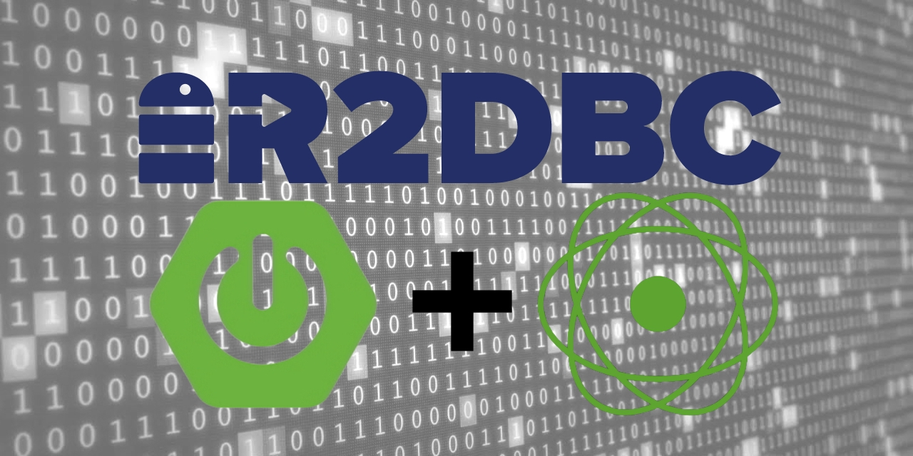

# Spring Boot WebFlux R2DBC Application


# Booting Up
<ol>
<li>Launch Postgres from Docker:</li>
  <code>docker run --rm -p 5432:5432 -e POSTGRES_PASSWORD=admin postgres:13.1-alpine -d postgres</code>
<li>Clone the repository:</li>
  <code>git clone https://github.com/davidarchanjo/spring-webflux-r2dbc</code>
<li>Navigate to the folder:</li>
  <code>cd spring-webflux-r2dbc</code>
<li>Install dependencies and build the application:</li>
  <code>mvn clean install</code>
<li>Run the application:</li>
  <code>java -jar target/spring-webflux-r2dbc-1.0.0.jar</code>
</ol>

# Testing
- Create New Author </br>
`POST /authors` </br>
    ```json
    {        
        "name": "David A. Pereira"
    }
    ```

- Create New Book </br>
`POST /books` </br>
    ```json
    {
        "idAuthor": "1efcf599-116f-1fb6-cf3c-13d7528b7fb7",
        "title": "Harry Potter: Hogwarts Mystery",
        "dateOfParution": "2021-11-28"
    }
    ```

# Reference
Inspired by this [project](https://www.sipios.com/blog-tech/handle-the-new-r2dbc-specification-in-java).
